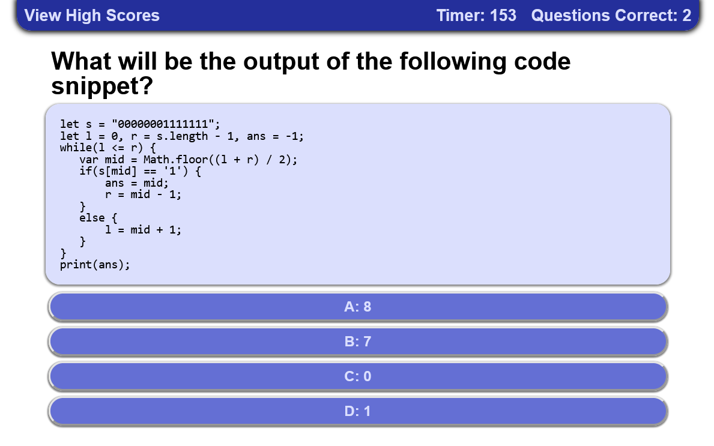

# JavaScript Quiz - Boot Camp Challenge 4

Description
=====
A timed and scored JavaScript quiz for people to test their knowledge of the language.

100 points are given for every correct answer and 15 seconds are subtracted from the clock for every incorrect answer.
At the end of the quiz, all remaining seconds on the timer are added as points to the user's score.

Scores are recorded after the end of the quiz, with the ten highest scores being saved.

Demo
=====
Here's a live deployed version of the quiz: [https://kurtbixby.github.io/Challenge-04-Code-Quiz/](https://kurtbixby.github.io/Challenge-04-Code-Quiz/).

Credits
=====
__[Kurt Bixby](https://github.com/kurtbixby)__ wrote the JavaScript, CSS, and HTML from scratch.

reset.css was provided by the UT Austin Web Development Boot Camp.

Quiz questions were sourced from [InterviewBit](https://www.interviewbit.com/javascript-mcq/).

Favicon sources from [IconArchive](https://iconarchive.com/show/flatwoken-icons-by-alecive/Apps-File-Javascript-icon.html)

## Collaborators
__[Andrew E](https://github.com/Andrew87E)__ helped me talk through my ideas and offered some thoughts on approaching some problems.
